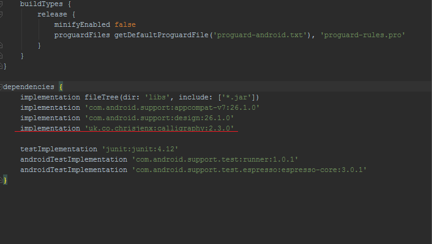
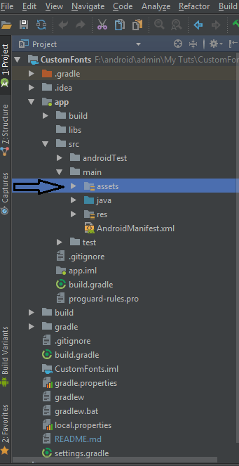
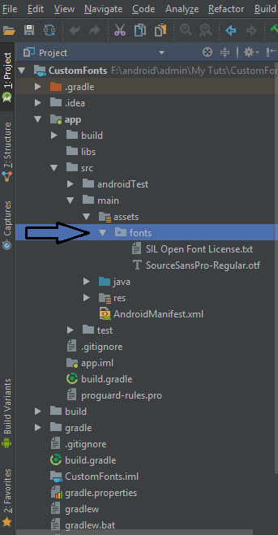
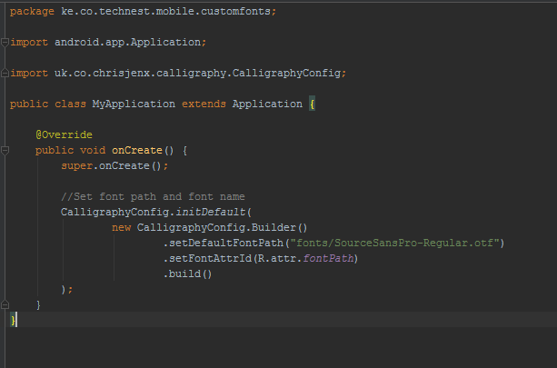
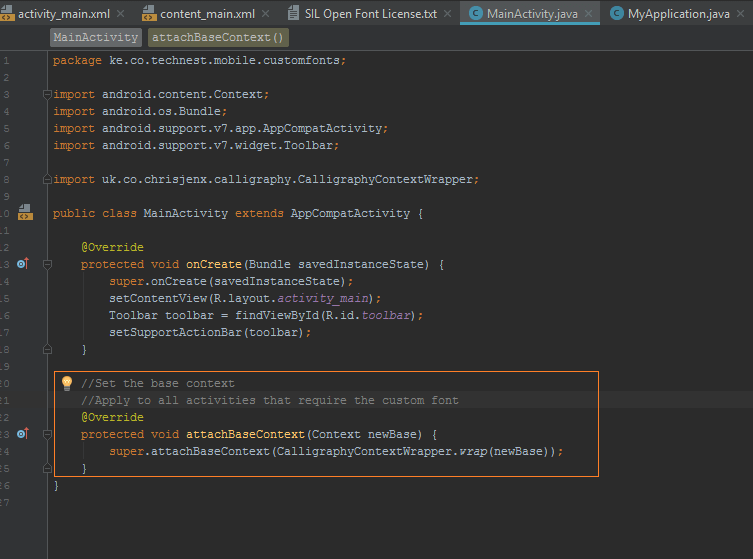

# android-custom-fonts
<h3>A simpe example on how to implement custom fonts on android.</h3> 
This example implements the <a href="https://github.com/chrisjenx/Calligraphy">Calligraphy Library</a> by Chris Jenx. 
Please do check it out. 
<h3>The implementation is pretty simple</h3>
<h4>Step 1: Add the gradle dependency</h4>
 
<h4>Step 2: Create an assets folder under main directory</h4>
This is where your fonts will be placed
 
<h4>Step 3: Add your fonts folder(containing a font file) to the assets folder</h4>
 
<h4>Step 4: Create a java class extending Application and add the code in the image below(and don't forget to declare the class in the manifest)</h4>
Note: the name of the font should be the same as the one in your fonts folder.
 
<h4>Finally: Override the method highlighted in the image below on any activity you want to implement the font</h4>
 